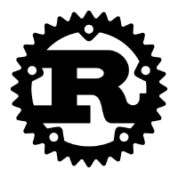

# Course Learn Rust by CodeShow


<p align="center">

</p>

COURSE about Rust by Bruno Rocha from [CodeShow](https://youtube.com/playlist?list=PLjSf4DcGBdiGCNOrCoFgtj0KrUq1MRUME&si=wDuL02FaaRXZ-kfU).

## Commands

```bash
# Compile rust code
rustc mycode.ts

# Create a new rust project
cargo new my-project

# Compile and build project
cargo build

# Build and run project
cargo run

# Format rust code
cargo fmt

# Watch for rust
cargo install cargo-watch
cargo watch -x run

# REPL rust
irust
```